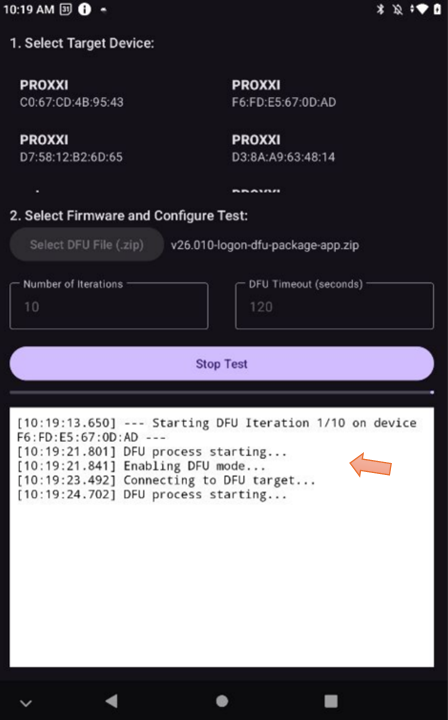

**Scope**

The app is used for conduct multiple DFU.

**How to use**:

Step 1, once the app is opened, it starts scanning. Select the device for testing according to its name and mac address:

Step 2: The selected device will be highlighted:

Step 3: Select the DFU zip file

Step 4: The number of iterations and DFU timeout can be set. If the DFU time is longer than expected, the DFU timeout can be set to 180s.

Step 5: Once both device and zip file are selected, the "Start Test" button is enabled, click it to start the test.

Step 6: Once running, the status of the test will be shown in the log window:

Step 7: During the test, the app will keep the screen on. The progress bar below the Stop Test button shows the progress. Stop Test button can be pressed to interrupt the test.

Step 8, Once finished, a button will appear at the bottom to allow the user to share the testing log:

Step 9: The log can be shared via email and other means:

The log contents the same info in the log window:

Step 10: To start a new test, click the New Test button:

